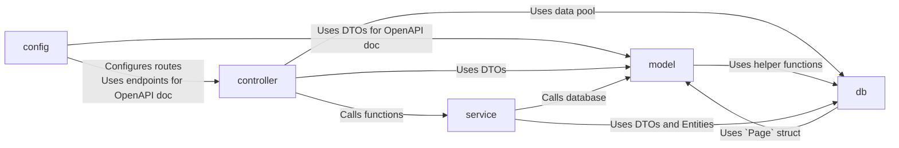
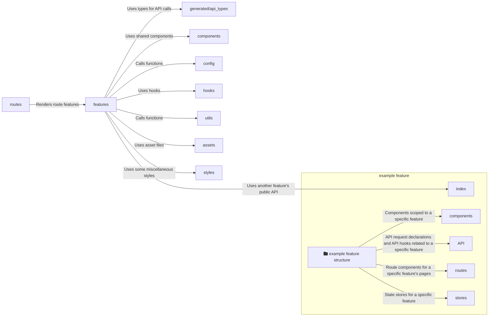

# Building Block View

## Backend Structure

- `config/`: Contains the servers configuration.
- `controller/`: Contains all endpoints of the application.
- `db/`: Contains utility functions for the database.
- `model/`: Contains the data PermaplanT is acting upon and their implementation.
- `service/`: Contains business logic and maps between entities and DTOs.
- `test/`: Contains integration tests.



### Controller

The controller layer contains all endpoints of the application.  
The actual routes are defined [here](https://github.com/ElektraInitiative/PermaplanT/blob/master/backend/src/config/routes.rs) while the controller layer only contains the actual implementation of the endpoints.

When an endpoint gets called Actix clones an internally stored pool of connections to the database and passes it to the endpoint to be used.  
We then 'forward' the pool to the service layer where a connection is retrieved from the pool.  
The persistence layer then uses that connection to make calls to the database.

The endpoints are automatically documented using [utoipa](https://github.com/juhaku/utoipa) which can generate OpenAPI documentation from code.

### Service

The service layer is responsible for handling our business logic as well as mapping entities and DTOs.

### Model

The [model/](https://github.com/ElektraInitiative/PermaplanT/tree/master/backend/src/model) folder contains the data PermaplanT is acting upon.  
Entities are shared with the database using the ORM [diesel](https://github.com/diesel-rs/diesel).  
DTOs are shared with the frontend using [typeshare](https://github.com/1Password/typeshare).

The files [entity.rs](https://github.com/ElektraInitiative/PermaplanT/blob/master/backend/src/model/entity.rs) and [dto.rs](https://github.com/ElektraInitiative/PermaplanT/blob/master/backend/src/model/dto.rs) contain the actual structs.
That way you have a quick overview of what the data looks like without having to navigate multiple files.  
The actual implementation of the structs is in separate files to reduce the line length of the files.

## Frontend Structure

- `__mocks__/`: Contains mocked modules for tests.
- `assets/`: Contains small asset files like SVGs.
- `components/`: Contains components that are shared across features.
- `config/`: Contains initialization code for the environment and libraries.
- `features/`: Contains the distinct features of the application.
- `generated/`: Contains generated code.
  - `docs/`: Automatically generated documentation.
  - `api_types/`: The types generated via typeshare from the backend API.
- `hooks/`: Contains hooks that are shared across features.
- `routes/`: Contains the routes of the application.
- `styles/`: Contains the global and other style sheets, e.g. to customize a component from a third party library like `react-leaflet`.
- `utils/`: Contains additional utility functions, that are shared across features or components and are not hooks.



`__mocks__` is not used during runtime

### `__mocks__`

This folder has a special name to be recognized by our test runner vi.
More details on how mocking with jest works can be found in the [jest documentation](https://jestjs.io/docs/manual-mocks).

### `assets`

This folder should contain only small asset files like SVGs, so that our bundle size stays small.
Larger files should be hosted on Nextcloud.

### `generated/api_types`

This folder contains API types that are generated by `typeshare`.
They can be regenerated by running the command `npm run generate-api-types`.

### `components`

All components that reside inside here need to be documented in storybook.

The minimum requirements for documentation are:

- If the component can be in different states (e.g. a visual variant, or an open/closed state), each state should be described by a story.
- Every property that can be passed to the component needs to be documented.

### `features`

Most of the application's code lives here.
Every folder created here represents a given feature and contains its domain specific code.
For example, if a feature interacts with the backend via network requests, it would have a sub module `api` that encapsulates this.

Features are allowed to import another feature's public API which is exported from its `index.ts` file.
Features are also allowed to import all other previously mentioned modules if needed.

#### `map_planning`

**store**:

The store is composed of two sub-stores:

- `TrackedMapStore`: stores the state of the map that is tracked by the history.
  This state is used to undo/redo actions.

- `UntrackedMapStore`: stores the state of the map that is not tracked by the history
  (e.g. the selected layer and the layer opacities).

For each layer there is a `TrackedLayerState` and an `UntrackedLayerState`.
If the layer introduces new properties the new types (e.g. `TrackedPlantLayerState` and `UntrackedPlantLayerState`) should be extended from these.
The same applies for the corresponding `ObjectState` types.

- add new types

```ts
/**
 * The state of an image object.
 */
export type ImageObjectState = ObjectState & {
  imageUri: string;
};

/**
 * The state of a map's photo layer.
 */
export type TrackedPhotoLayerState = {
  index: LayerName;
  /**
   * The state of the objects on the layer.
   */
  objects: ImageObjectState[];
};
```

- modify layer type

```ts
/**
 * The state of the layers of the map.
 */
export type TrackedLayers = {
  [key in Exclude<LayerName, "Photo">]: TrackedLayerState;
} & {
  Photo: TrackedPhotoLayerState;
};
```

the above construct may eventually be refactored into the below as more specific types get added to the layer state.

```ts
export type TrackedLayers = {
  Base: TrackedBaseLayerState;
} & {
  Plant: TrackedPlantLayerState;
} & {
  Photo: TrackedPhotoLayerState;
} & {
  ...
}
```
