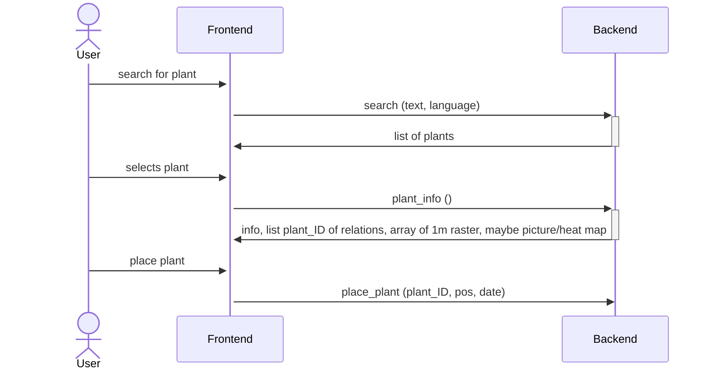
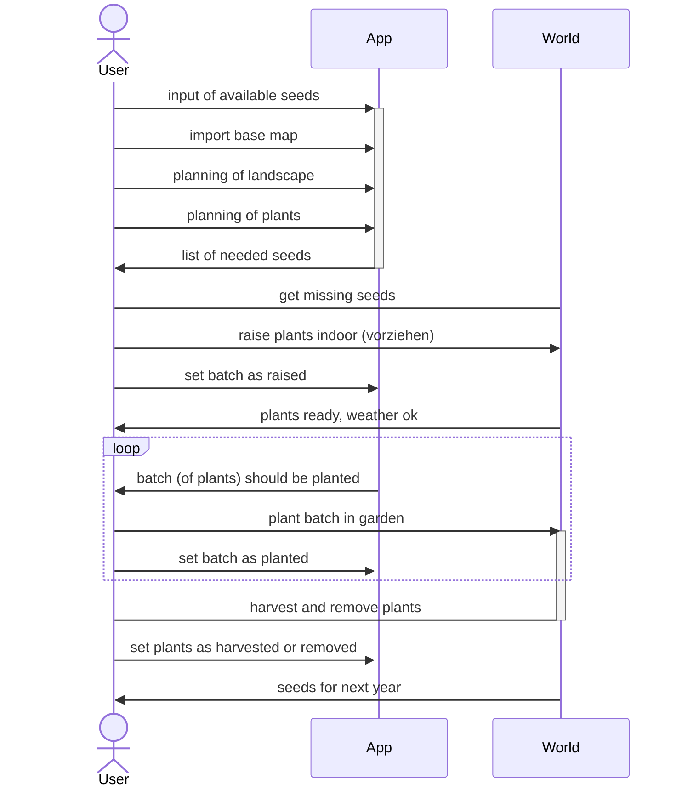

# Runtime View

## Plants

```mermaid
sequenceDiagram
    actor User
    User->>+Frontend: search for plant
    Frontend->>+Backend: search (text, language)
    Backend->>-Frontend: list of plants
    User->>Frontend: selects plant
    Frontend->>+Backend: plant_info ()
    Backend->>-Frontend: info, list plant_ID of relations, array of 1m raster, maybe picture/heat map
    User->>Frontend: place plant
    Frontend->>Backend: place_plant (plant_ID, pos, date)
```

## Season

Example of a typical sequence in one season:

```mermaid
sequenceDiagram
    actor User
    User->>+App: input of available seeds
    User->>App: import base map
    User->>App: planning of landscape
    User->>App: planning of plants
    App->>-User: list of needed seeds
    User->World: get missing seeds
    User->>World: raise plants indoor (vorziehen)
    User->>App: set batch as raised

    World->>User: plants ready, weather ok
    loop
        App->>User: batch (of plants) should be planted
        User->>World: plant batch in garden
        activate World
        User->>+App: set batch as planted


    end

    User->World: harvest and remove plants
    deactivate World
    User->>App: set plants as harvested or removed
    World->>User: seeds for next year
```
