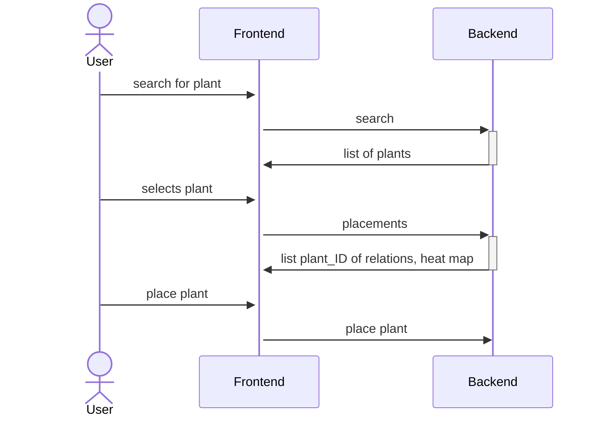
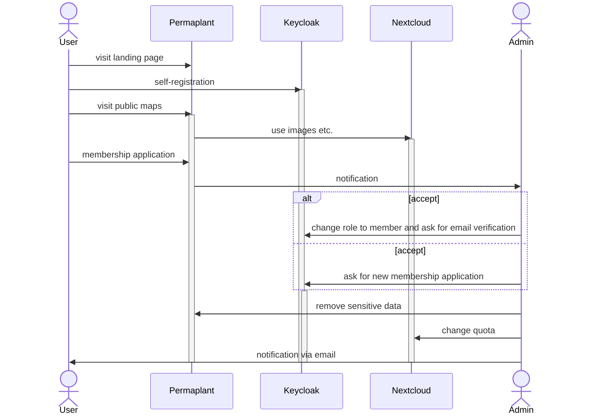
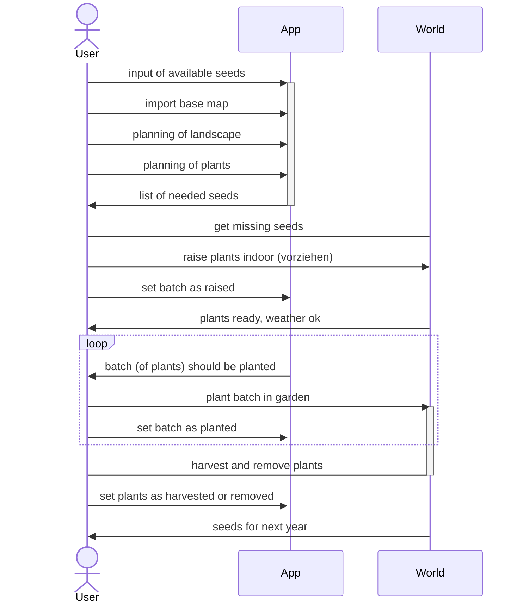

# Runtime View

## Plantings

- search via GET on /api/plants
- placements via GET on /api/maps/{map_id}/layers/plants/placements
- place plant via POST on /api/maps/{map_id}/layers/plants/plantings (plant_ID, pos, date)

## Onboarding

## Season

Example of a typical sequence in one season:

