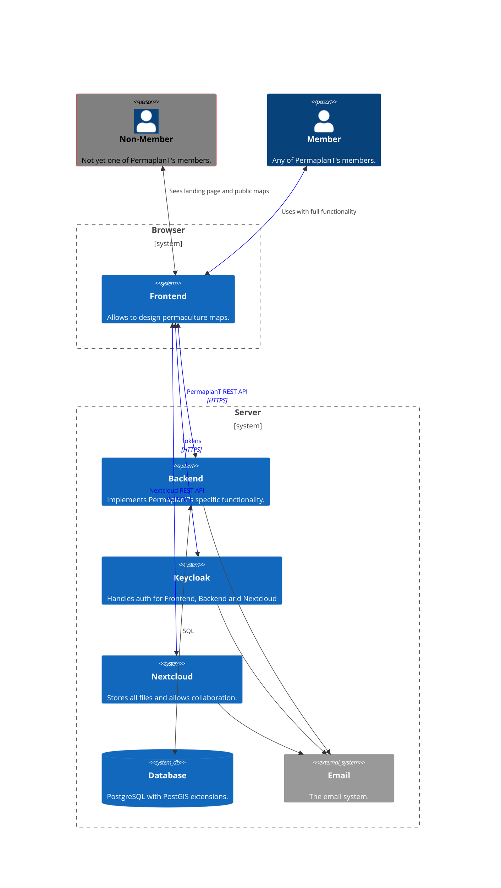

# Deployment

```mermaid
C4Context
    Person(person, "Non-Member", "Not yet one of PermaplanT's members.")
    Person(member, "Member", "Any of PermaplanT's members.")

    Boundary(browser, "Browser") {
        System(Frontend, "Frontend", "Allows to design permaculture maps.")
    }

    Boundary(server, "Server") {
        System(Backend, "Backend", "Implements PermaplanT's specific functionality.")

        System(Keycloak, "Keycloak", "Handles auth for Frontend, Backend and Nextcloud")

        System(Nextcloud, "Nextcloud", "Stores all files and allows collaboration.")

        SystemDb(Database, "Database", "PostgreSQL with PostGIS extensions.")
        System_Ext(Email, "Email", "The email system.")
    }


    BiRel(person, Frontend, "Sees landing page and public maps")

    BiRel(member, Frontend, "Uses with full functionality")

    BiRel(Frontend, Nextcloud, "Nextcloud REST API", "HTTPS")

    BiRel(Frontend, Backend, "PermaplanT REST API", "HTTPS")

    BiRel(Frontend, Keycloak, "Tokens", "HTTPS")

    Rel(Backend, Email, "")
    Rel(Nextcloud, Email, "")
    Rel(Keycloak, Email, "")

    BiRel(Database, Backend, "SQL")

    UpdateElementStyle(person, $fontColor="black", $bgColor="grey", $borderColor="red")
    UpdateRelStyle(person, Frontend, $offsetX="0", $offsetY="-60")

    UpdateRelStyle(member, Frontend, $textColor="b", $lineColor="blue", $offsetX="50", $offsetY="-20")

    UpdateRelStyle(Frontend, Backend, $textColor="blue", $lineColor="blue")
    UpdateRelStyle(Frontend, Keycloak, $textColor="blue", $lineColor="blue", $offsetX="-10")
    UpdateRelStyle(Frontend, Nextcloud, $textColor="blue", $lineColor="blue", $offsetX="-50")

    UpdateLayoutConfig($c4ShapeInRow="4", $c4BoundaryInRow="1")
```
