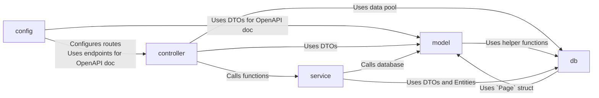

# Backend Architecture

## Structure

- `config/`: Contains the servers configuration.
- `controller/`: Contains all endpoints of the application.
- `db/`: Contains utility functions for the database.
- `model/`: Contains the data PermaplanT is acting upon and their implementation.
- `service/`: Contains business logic and maps between entities and DTOs.
- `test/`: Contains integration tests.

### Controller

The controller layer contains all endpoints of the application.  
The actual routes are defined in [config/routes.rs](/backend/src/config/routes.rs) while the controller layer only contains the actual implementation of the endpoints.

When an endpoint gets called Actix clones an internally stored pool of connections to the database and passes it to the endpoint to be used.  
We then 'forward' the pool to the service layer where a connection is retrieved from the pool.  
The persistence layer then uses that connection to make calls to the database.

The endpoints are automatically documented using [utoipa](https://github.com/juhaku/utoipa) which can generated OpenAPI documentation from code.

### Service

The service layer is responsible for handling our business logic as well as mapping entities and DTOs.

### Model

The [model/](/backend/src/model/) folder contains the data PermaplanT is acting upon.  
Entities are shared with the database using the ORM [diesel](https://github.com/diesel-rs/diesel).  
DTOs are shared with the frontend using [typeshare](https://github.com/1Password/typeshare).

The files [entity.rs](/backend/src/model/entity.rs) and [dto.rs](/backend/src/model/dto.rs) contain the actual structs.
That way you have a quick overview of what the data looks like without having to navigate multiple files.  
The actual implementation of the structs is in separate files to reduce the line length of the files.

### Tests

Tests are split into unit and integration tests (see [here](/doc/tests/) for reference).

Integration tests can be found in [test/](/backend/src/test/).  
Unit tests can be found in the modules they are supposed to test.

## Graceful Shutdown

Actix by default handles shutdowns (see [here](https://actix.rs/docs/server/#graceful-shutdown) for reference).  
As soon as the signal `SIGTERM` is issued to the backend no new connections will be accepted.

- Still running connection will be finished or terminated after 5sec.
- API requests should ideally take no longer than a few seconds, with a 5-second limit for logging and optimization purposes.
- Implementing this limit improves convenience for both developers (termination of endless loops) and continuous integration (faster restart on hanging API calls), with minimal complexity in the code.

## Code documentation

The code documentation of the backend can be built using `cargo doc --open`.

You can find a more detailed explanation of which modules do what there.

## API documentation

The API documentation can be viewed by running the backend with `cargo run` and then navigating to <http://localhost:8080/doc/api/swagger/ui/>.  
It is automatically built using [utoipa](https://github.com/juhaku/utoipa).
