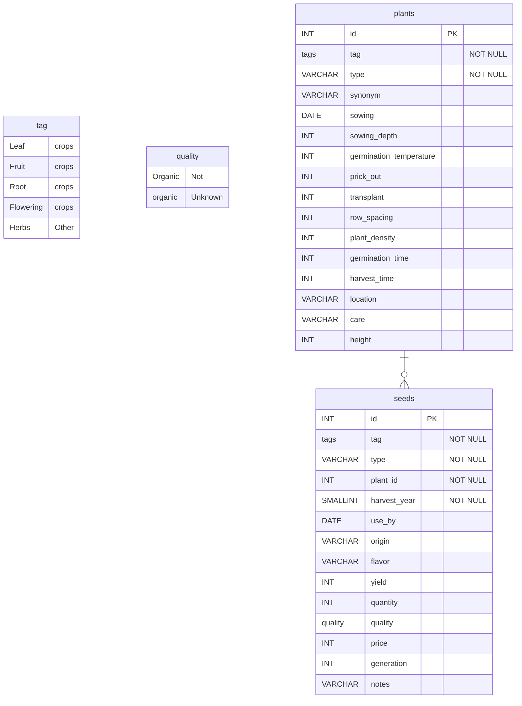

# Database Schemata

Tag and Quality in this case are enum. 
Postgres supports [enums](https://www.postgresql.org/docs/current/datatype-enum.html) so it is easy to define a static set of values. 

```sql
CREATE TYPE tag AS ENUM (
  'Leaf crops',
  'Fruit crops',
  'Root crops',
  'Flowering crops',
  'Herbs',
  'Other'
);

CREATE TYPE quality AS ENUM (
  'Organic',
  'Not organic',
  'Unknown'
);

CREATE TABLE plants (
  id SERIAL PRIMARY KEY,
  tag tag[] NOT NULL,
  type VARCHAR(255) NOT NULL,
  synonym VARCHAR(255),
  sowing DATE,
  sowing_depth INTEGER,
  germination_temperature INTEGER,
  prick_out INTEGER,
  transplant INTEGER,
  row_spacing INTEGER,
  plant_density INTEGER,
  germination_time INTEGER,
  harvest_time DATE,
  location VARCHAR(255),
  care VARCHAR(255),
  height INTEGER
);

CREATE TABLE seeds (
  id SERIAL PRIMARY KEY,
  tag tag[] NOT NULL,
  type VARCHAR(255) NOT NULL,
  plant_id INTEGER REFERENCES plants(id) NOT NULL,
  harvest_year INTEGER NOT NULL,
  use_by DATE,
  origin VARCHAR(255),
  flavor VARCHAR(255),
  yield INTEGER,
  quantity INTEGER,
  quality quality,
  price NUMERIC(10, 2),
  generation INTEGER,
  notes TEXT
);
```
# ER Diagram

