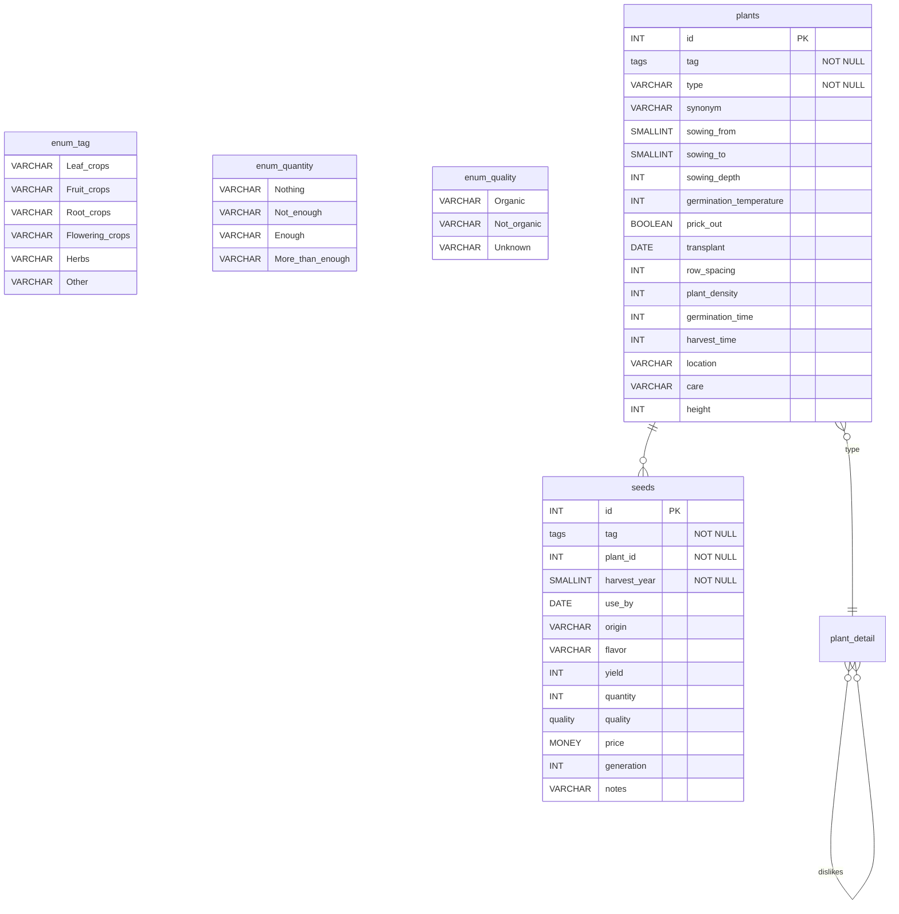
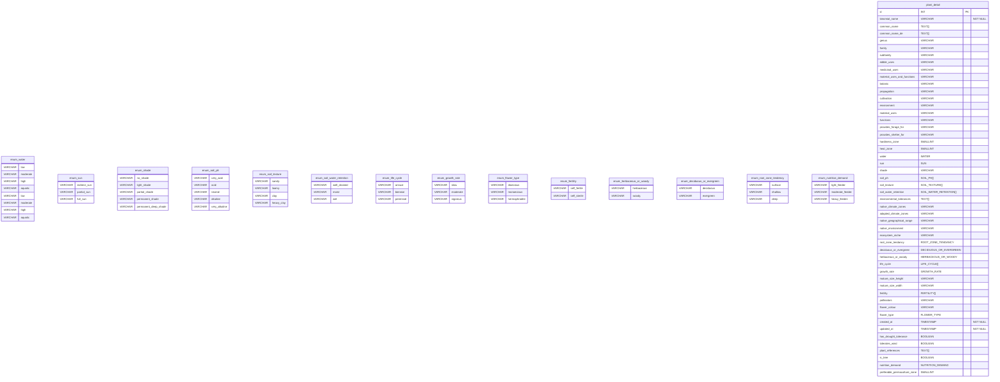

# Database Schemata

Tag and Quality in this case are enum.
Postgres supports [enums](https://www.postgresql.org/docs/current/datatype-enum.html) so it is easy to define a static set of values.
Right now, Mermaid doesn't support enum types so a `_` character denotes white spaces in enums.

# ER Diagram

# Table descriptions

## `Plant_detail`

| **_Column name_**                | **_Example_**                    | **_Description_**                                   |
| :------------------------------- | :------------------------------- | :-------------------------------------------------- |
| **id**                           | 1                                |
| **binomial_name**                | Abelia triflora                  |
| **common_name**                  | NULL                             |
| **common_name_de**               | NULL                             |
| **family**                       | Caprifoliaceae                   |
| **subfamily**                    | NULL                             |
| **genus**                        | Abelia                           |
| **edible_uses**                  | NULL                             |
| **medicinal_uses**               | NULL                             |
| **material_uses_and_functions**  | \[1\]\[2\]                       |
| **botanic**                      | \[3\]\[6\]                       |
| **propagation**                  | NULL                             |
| **cultivation**                  | NULL                             |
| **environment**                  | NULL                             |
| **material_uses**                | NULL                             |
| **functions**                    | NULL                             |
| **provides_forage_for**          | NULL                             |
| **provides_shelter_for**         | NULL                             |
| **hardiness_zone**               | 6                                |
| **heat_zone**                    | NULL                             |
| **water**                        | moderate                         |
| **sun**                          | full sun                         |
| **shade**                        | light shade                      |
| **soil_ph**                      | {neutral,alkaline,very alkaline} |
| **soil_texture**                 | {sandy,loamy}                    |
| **soil_water_retention**         | NULL                             |
| **environmental_tolerances**     | NULL                             |
| **native_climate_zones**         | NULL                             |
| **adapted_climate_zones**        | NULL                             |
| **native_geographical_range**    | NULL                             |
| **native_environment**           | NULL                             |
| **ecosystem_niche**              | NULL                             |
| **root_zone_tendancy**           | NULL                             |
| **deciduous_or_evergreen**       | deciduous                        |
| **herbaceous_or_woody**          | woody                            |
| **life_cycle**                   | {perennial}                      |
| **growth_rate**                  | slow                             |
| **mature_size_height**           | 3.5                              |
| **mature_size_width**            | 3                                |
| **fertility**                    | NULL                             |
| **pollinators**                  | NULL                             |
| **flower_colour**                | NULL                             |
| **flower_type**                  | hermaphrodite                    |
| **created_at**                   | 2023-02-09 14:06:01.451028       |
| **updated_at**                   | 2023-02-09 14:06:01.451028       |
| **has_drought_tolerance**        | false                            |
| **tolerates_wind**               | false                            |
| **plant_references**             | {ref1, ref2)}                    |
| **is_tree**                      | true                             | Herbaceous/Woody (woody) AND life cycle (perennial) |
| **nutrition_demand**             | NULL                             |
| **preferable_permaculture_zone** | NULL                             | -1..6 (-1 should be printed as 00)                  |
