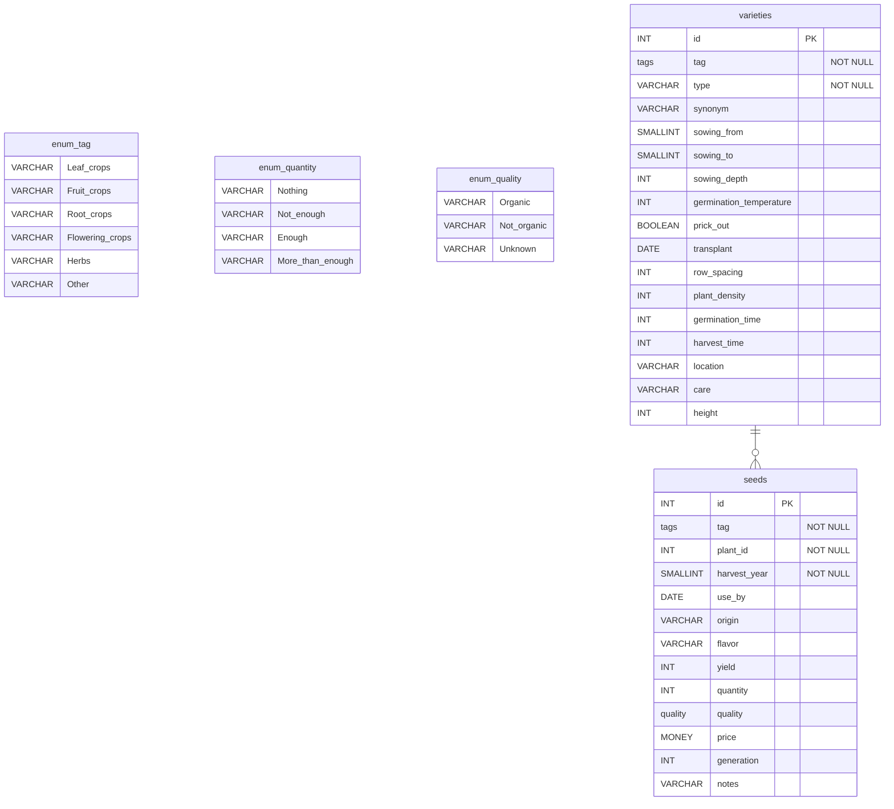

# Database Schemata

Tag and Quality in this case are enum. 
Postgres supports [enums](https://www.postgresql.org/docs/current/datatype-enum.html) so it is easy to define a static set of values. 
Right now, Mermaid doesn't support enum types so a `_` character denotes white spaces in enums.

# ER Diagram

