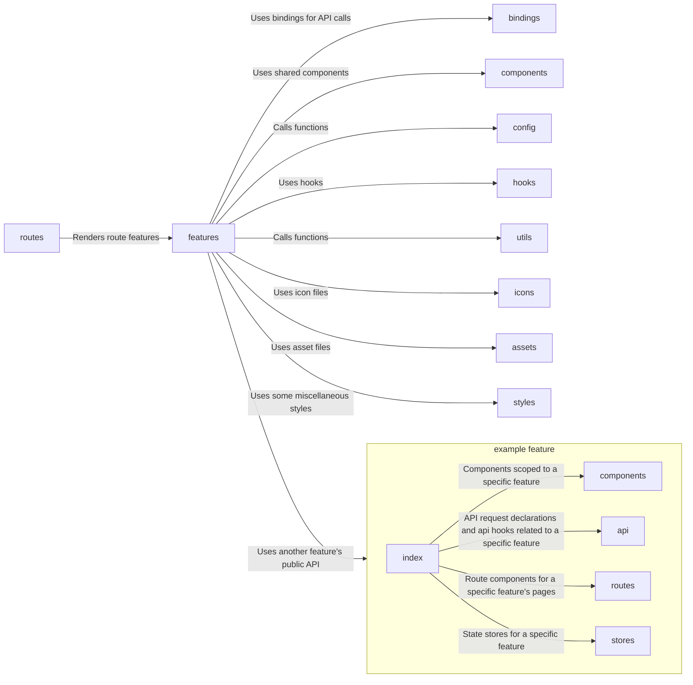

# Frontend Architecture

## Structure

- `__mocks__/`: Contains mocked modules for tests
- `assets/`: Contains asset files like images
- `bindings/`: Contains the generated API bindings
- `components/`: Contains components that are shared across features
- `config/`: Contains initialization code for the environment and libraries
- `features/`: Contains the distinct features of the application
  - `dark_mode/`: Contains the dark_mode feature (Switcher and store)
  - `imprint_page/`: Contains the imprint page
  - `landing_page/`: Contains the landing page
  - `map_planning/`: Contains the map with layers
  - `seeds/`: Contains the seed routes
- `generated/`: Contains generated code, for now only docs
- `hooks/`: Contains hooks that are shared across features
- `icons/`: Contains svg icons
- `routes/`: Contains the routes of the application
- `styles/`: Contains the global and miscellaneous style sheets
- `utils/`: Contains additional utility functions

`__mocks__` and `generated` are not used during runtime

### Features

Most of the applications code lives here.
Every folder created here represents a given feature and contains its domain specific code.
Features are allowed to import another features public API which is exported from its `index.ts` file.
Features are also allowed to import all other previously mentioned modules if needed.

### Code documentation

The code documentation of the frontend can be generated via the command `npm run doc`.

Afterwards it can be opened in storybook via the command `npm run storybook`.
