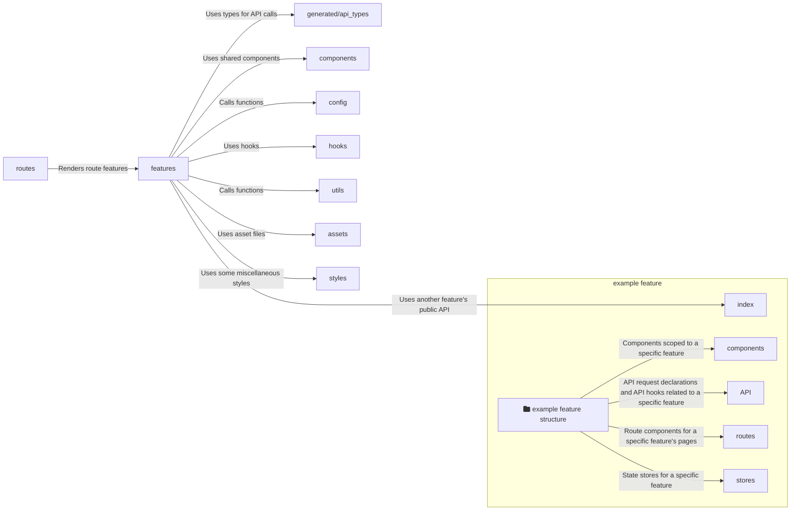

# Frontend Architecture

## Structure

- `__mocks__/`: Contains mocked modules for tests.
- `assets/`: Contains small asset files like SVGs.
- `bindings/`: Contains the generated API bindings.
- `components/`: Contains components that are shared across features.
- `config/`: Contains initialization code for the environment and libraries.
- `features/`: Contains the distinct features of the application.
- `generated/`: Contains generated code.
  - `docs/`: Automatically generated documentation.
  - `api_types/`: The types generated via typeshare from the backend API.
- `hooks/`: Contains hooks that are shared across features.
- `routes/`: Contains the routes of the application.
- `styles/`: Contains the global and other style sheets, e.g. to customize a component from a third party library like `react-leaflet`.
- `utils/`: Contains additional utility functions, that are shared across features or components and are not hooks.

`__mocks__` is not used during runtime

### `__mocks__`

This folder has a special name to be recognized by our test runner jest.
More details on how mocking with jest works can be found in the [jest documentation](https://jestjs.io/docs/manual-mocks).

### `assets`

This folder should contain only small asset files like SVGs, so that our bundle size stays small.
Larger files should be hosted on Nextcloud.

### `bindings`

This folder contains API bindings that are generated by `typeshare`.
They can be regenerated by running the command `npm run generate-api-types`.

### `components`

All components that reside inside here need to be documented in storybook.

The minimum requirements for documentation are:

- If the component can be in different states (e.g. a visual variant, or an open/closed state), each state should be described by a story.
- Every property that can be passed to the component needs to be documented.

### `features`

Most of the application's code lives here.
Every folder created here represents a given feature and contains its domain specific code.
For example, if a feature interacts with the backend via network requests, it would have a sub module `api` that encapsulates this.

Features are allowed to import another features public API which is exported from its `index.ts` file.
Features are also allowed to import all other previously mentioned modules if needed.

### Code Documentation

The code in the frontend is documented by two different mechanisms.
On the one hand components are documented via storybook, on the other hand the public API of a feature, shared hook or utility, etc. should be documented by doc comments.
We use TypeDoc to extract the documentation from code comments.
More details about supported tags and syntax can be found in the [TypeDoc documentation](https://typedoc.org/guides/doccomments/).

The code documentation of the frontend can be generated via the command `npm run doc`.
Under the hood, this command executes TypeDoc that generates `.mdx` files to be viewed in storybook.

Afterwards it can be opened in storybook via the command `npm run storybook`.

More details about documentation can be found in the [contribution docs](/doc/contrib/frontend.md#documentation)
