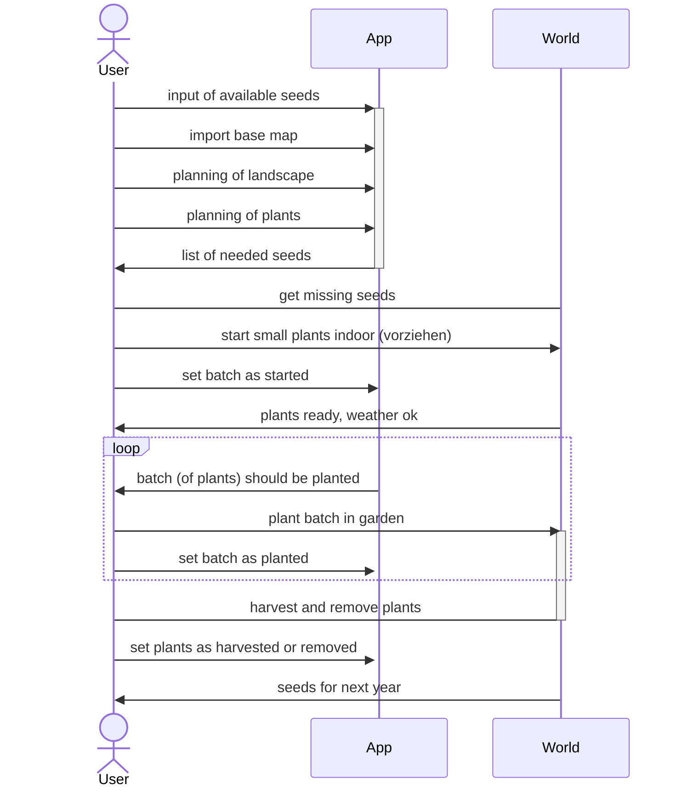

# Sequence

Example of a typical sequence in one season:

```mermaid
sequenceDiagram
    actor User
    User->>+App: input of available seeds
    User->>App: import base map
    User->>App: planning of landscape
    User->>App: planning of plants
    App->>-User: list of needed seeds
    User->World: get missing seeds
    User->>World: start small plants indoor (vorziehen)
    User->>App: set batch as started

    World->>User: plants ready, weather ok
    loop
        App->>User: batch (of plants) should be planted
        User->>World: plant batch in garden
        activate World
        User->>+App: set batch as planted


    end

    User->World: harvest and remove plants
    deactivate World
    User->>App: set plants as harvested or removed
    World->>User: seeds for next year
```
