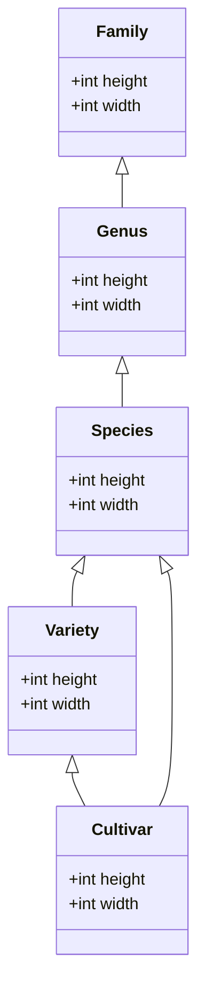

# Hierarchy

This document explains the hierarchy of the plants table.
Please make sure that you already read the [biology section of the glossary](/doc/architecture/glossary.md).

## Introduction

The plants table contains entries of:

- concrete plants, or
- abstract plants (representants of ranks)

_Concrete plants_ can be:

- dragged and dropped to the map and
- used as seed entry.

_Abstract plants_ can be:

- used to inherit attributes.

A concrete plant can be of following rank:

- on species level, or
- on variety level, or
- on cultivar level.

Furthermore following must be true:

- genus is below a family,
- specie is below a genus,
- a variety is below a specie,
- a cultivar is below to a specie or a variety

The diagram below shows the hierarchy of entities with `height` and `width` as an example of attribute classification.

Each of these entities can have their own attributes.
E.g., a variety below a specie can have different height than the specie itself.

## Unique Name

In the database we have a column `unique_name`.
The unique name are, either for abstract plants:

- single latin word to specify "family", which always ends on: `-aceae`
- single latin word to specify "genus"

Or is built up by several words (for concrete plants):

- single latin word to specify "genus"
- single latin word to specify "specie"
- optional single latin word to specify "variety"
- optional several words in single quotes to specify "cultivar", which starts with a capital letter

E.g. `Brassica oleracea italica 'Ramoso calabrese'`

### Hybrid names

Hybrid names are built up differently.
Either two parent binomials, separated by a "x" or "×" or a given binomial, with or without an intercalated "×"
(see [Wikipedia](https://en.wikipedia.org/wiki/Hybrid_name)).
So the name does not necessarily say if a plant is a hybrid.

### Rendering

The unique name must be rendered:

- Latin name in _italics_.
- Cultivar name normal font in single quotes (as in database).

E.g.: _Brassica oleracea italica_ 'Ramoso calabrese'

### Rules

We know about names (abstract and concrete, including hybrid):

- If it contains more than one word, it is a concrete plant.
- If it contains only one word, it is an abstract plant (family or genus).
- All entries with 2 words are a specie (de: Art),
- All entries with 3 or more words are either:
  - variety (de: Varietät) if all is spelled italic, or
  - are cultivar (de: Sorte) if last part of the name (can be more than 1 word!) is not latin, not italic, is in 'single quotes'
- All entries with a single x between the words are hybrid.
  We treat them like specie.

## Attributes

We prefer strongly-typed data, e.g.:

- enums
- array of enums
- numbers

Columns that contain text should be postfixed with:

- `_en` for English text
- `_de` for German text

As we often copy data from other sources, we maintain following columns for external references:

- `external_source`: an array from enum where the first entry is the "main source" the other columns refer to:
- `external_id`: an identifier of that source
- `external_url`: the URL from where the data was taken

Plants are additionally classified as:

- is_concrete_plant (is a concrete plant as opposite to an abstract plant)
- is_tree (as search help within the tree layer)

## Mappings

### from Permapeople

Column names should be:

- `unique_name` (see above), instead of `binomial_name`
- `common_name_en` (still with arrays of Text as content)
- `common_name_de` should be from Wikipedia (still with arrays of Text as content), `german_name` gets removed
- `hardiness_zone` (usda in documentation)
- `light_requirement` (and not `sun`)
- `water_requirement` (and not `water`)
- `soil_texture` (and not `soil_type`)
- `height` (and not `mature_size_height`, mature height in documentation)
- `width` (and not `mature_size_width`, mature width in documentation)
- `propagation_method` (and not `propagation`)
- `growth_rate` (and not `growth`)
- `has_drought_tolerance`
- `parent_id`
- `root_depth` (and not `root_zone_tendancy`)
- `id` should be `external_id`
- `external_source` should contain the enum value for `permapeople`

Following columns should be removed:

- `environment` (and its references)
- `type` and `is_variety`, as variety is now determined from the name (`rank` to be calculated from name, see above)
- `wildflower`
- `plants_of_the_world_online_name_synonym` (redundant to link)
- `dutch_name`, `danish_name`, `french_name`
- `when_to_harvest`
- `propagation_cuttings`
- `alternate_scientific_name`
- `hortipedia`
- `invasive_in`
- `years_to_bear`
- `useful_tropical_plants`
- `thinning`
- `light_tolerance`
- `chill_hours`, `beef_tomato`, `invasive`
- `folder_name` (at least in DB)
- `native_climate_zones`
- `adapted_climate_zones`
- `propagation_direct_sowing`

Rename:

- `when_to_sow_outdoors` to `sowing_outdoors_en`
- `edible_uses` to `edible_uses_en`
- `spacing` to `spacing_en`
- `seed_planting_depth` to `seed_planting_depth_en`
- `1000_seed_weight` to `seed_weight` (Documentation should state it is "thousand grain weight/Tausendkornmasse")

Bug:

- `provides_forage_for` or `provides_shelter_for`: seems to be a bug in scraper (currently empty but was in practical plants?)

Other minor problems:

- fix Labiatae to be lamiaceae (family rank)
- Remove all "var." from the database entries (staying with the 3 words).

### from Reinsaat

Unique name:

- use `Scientific name subheading` together with `name` (as cultivar, see above) for our `unique_name`
  (`Cucurbita ssp.` from `Scientific name kulturhinweise` shouldn't exist)
- Remove all occurrences of `L.`, `MIll.`, and `var.`.
- Entries on Reinsaat that are spelled like "Brassica oleracea convar. botrytis var. italica" (https://www.reinsaat.at/shop/EN/brassica/broccoli/limba/) exist in our database as "Brassica oleracea italica".
  Add the Reinsaat entry to our database in a different row with the following nomenclature:
  Brassica oleracea italica 'Limba', with `Brassica oleracea italica` as parent, by following rules:
  - Remove the term "convar." and its following word.
  - Remove the "ssp." and its following word.
- The `name` maps to cultivar (de: Sorte), i.e. a rank below variety and is expressed in non-latin words, such as 'Limba'.
  In our database we want them:
  - back together in one name (the unique name, as described above) e.g. Brassica oleracea italica 'Limba' or Malus domestica 'Gala'.
  - with a link to the variety, if present, otherwise species

New columns:

- `Artikelnummer` should be called `external_article_number`
- `Portionsinhalt` should be called `external_portion_content`
- `Direktsaat` or `Aussaat` should be called `sowing_outdoors_de`
- `Aussaat/ Pflanzung Freiland` should be called `sowing_outdoors`
- `Ernte` should be called `harvest_time`
- `Abstände` should be called `spacing_de`
- `Saatgutbedarf` should be called `required_quantity_of_seeds_de`
- `Required quantity of seeds` should be called `required_quantity_of_seeds_en`
- `Saattiefe` should be called `seed_planting_depth_de`
- `Tausendkornmasse` should be called `seed_weight_de`
- `Thousand seeds mass` should be called `seed_weight_en`
- `Suitable for professional cultivation` should be called `machine_cultivation_possible`

Copy columns:

- `subcategory` should be copied to `edible_uses_de` and `edible_uses_en` respectively (DE and EN version)
- `Tausendkorngewicht (TKG)` should be copied to `seed_weight` (remove ` g`)
- `Sowing` or `Direct Sowing` or `Sowing outdoors` or `Sowing Direct Outdoors` should be copied to `sowing_outdoors_en`
- `Distances` or `Spacing` should be copied to `spacing_en`
- `Sowing depth` should be copied to `seed_planting_depth_en`
- `1st harvest` should be copied to `days_to_harvest`
- `Keimtemperatur` should be copied to `germination_temperature`
- `external_url`
- `external_id`
- `external_source` should contain the enum value for `reinsaat`

Individual problems:

- Daucus carota L. ssp. sativus --> Daucus carota sativus
- Petroselinum crispum ssp. tuberosum --> Petroselinum crispum tuberosum
- Papaver somnif. var. paeonifl. --> Papaver somniferum paeoniflorum
- Alcea rosea fl. pl. --> Alcea rosea flore pleno
- Campanula lat. macr. --> Campanula latifolia macrantha
- Malva sylvestris ssp. maur. --> Malva sylvestris mauritiana
- Sonnenblume, Velvet Queen: `None` should be `Helianthus annuus`

## Further Readings

- Rationale is explained [in this decision](doc/decisions/database_plant_hierarchy.md).
