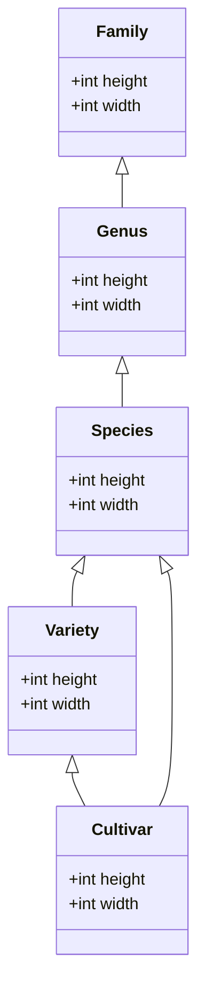

# Hierarchy

This document explains the hierarchy of the plants table.
Please make sure that you already read the [biology section of the glossary](/doc/architecture/glossary.md).

## Introduction

The plants table contains entries of:

- concrete plants, or
- abstract plants (representants of ranks)

*Concrete plants* can be:

- dragged and dropped to the map and
- used as seed entry.

*Abstract plants* can be:

- used to inherit attributes.

A concrete plant can be of following rank:

- on species level, or
- on variety level, or
- on cultivar level.

Furthermore following must be true:

- genus belongs to a family,
- specie belongs to a genus,
- a variety belongs to a specie,
- a cultivar is below to a specie or a variety

The diagram below shows the hierarchy of entities with `height` and `width` as an example of attribute classification.

Each of these entities can have their own attributes.
E.g., a variety under a specie can have different height than the specie that it belongs to.

## Unique Name

The unique name are, either for abstract plants:

- single latin word to specify "family", which always ends on: `-aceae`
- single latin word to specify "genus"

Or is built up by several words (for concrete plants):

- single latin word to specify "genus"
- single latin word to specify "specie"
- optional single latin word to specify "variety"
- optional several words in single quotes to specify "cultivar", which starts with a capital letter

E.g. `Brassica oleracea italica 'Ramoso calabrese'`

### Hybrid names

Hybrid names are built up differently.
Either two parent binomials, separated by a "x" or "×" or a given binomial, with or without an intercalated "×"
(see [Wikipedia](https://en.wikipedia.org/wiki/Hybrid_name).
So the name does not necessarily say if a plant is a hybrid.

### Rendering

The unique name must be rendered:

- Latin name in *italics*.
- Cultivar name normal font in single quotes (as in database).

E.g.: *Brassica oleracea italica* 'Ramoso calabrese'

### Rules

We know about names (abstract and concrete, including hybrid):

- If it contains more than one word, it is a concrete plant.
- If it contains only one word, it is an abstract plant (family or genus).
- All entries with 2 words are a specie (de: Art),
- All entries with 3 or more words are either:
  - variety (de: Varietät) if all is spelled italic, or
  - are cultivar (de: Sorte) if last part of the name (can be more than 1 word!) is not latin, not italic, is in 'single quotes'
- All entries with a single x between the words are hybrid.
  We treat them like specie.

## Attributes

Plants are additionally classified as:

- is_concrete_plant (is a concrete plant as opposite to an abstract plant)
- is_tree (as search help within the tree layer)

## Mappings

### from Reinsaat

- `L.`, `MIll.` can be removed
- Entries on Reinsaat that are spelled like "Brassica oleracea convar. botrytis var. italica" (https://www.reinsaat.at/shop/EN/brassica/broccoli/limba/) exist in our database as "Brassica oleracea italica".
  - Ignore the term "convar." and the following word.
  - Ignore the "var.".
  - Ignore the "ssp." and the "ssp." with its following word.
- cultivar (de: Sorte) is a rank below variety and is expressed in non-latin words, such as 'Limba', and is mostly found aside the Latin name. In our database we want them back together in one name (the unique name). The spelling should be:
  - cultivar name in single quotes.
  - cultivar name capitalized.
  - e.g. Brassica oleracea italica 'Limba' or Malus domestica 'Gala'.
- Add the Reinsaat entry to our database in a different row with the following nomenclature: Brassica oleracea italica 'Limba'.
- Use database information of "Brassica oleracea italica" (if no new information comes with "Limba", otherwise use all "Limba"-specific information and supplement with already existing data from database for higher rank).

- Cucurbita ssp. --> Cucurbita maxima/pepo/moschata
- Daucus carota L. ssp. sativus --> Daucus carota sativus
- Petroselinum crispum ssp. tuberosum --> Petroselinum crispum tuberosum

- edible_uses (practicalplants) contains oil

### from Permapeople

Labiatae = lamiaceae (family rank)
- Remove all "var." from the database entries (staying with the 3 words). -> TODO kommt nur 2x vor

## Further Readings

- Rationale is explained [in this decision](doc/decisions/database_plant_hierarchy.md).
