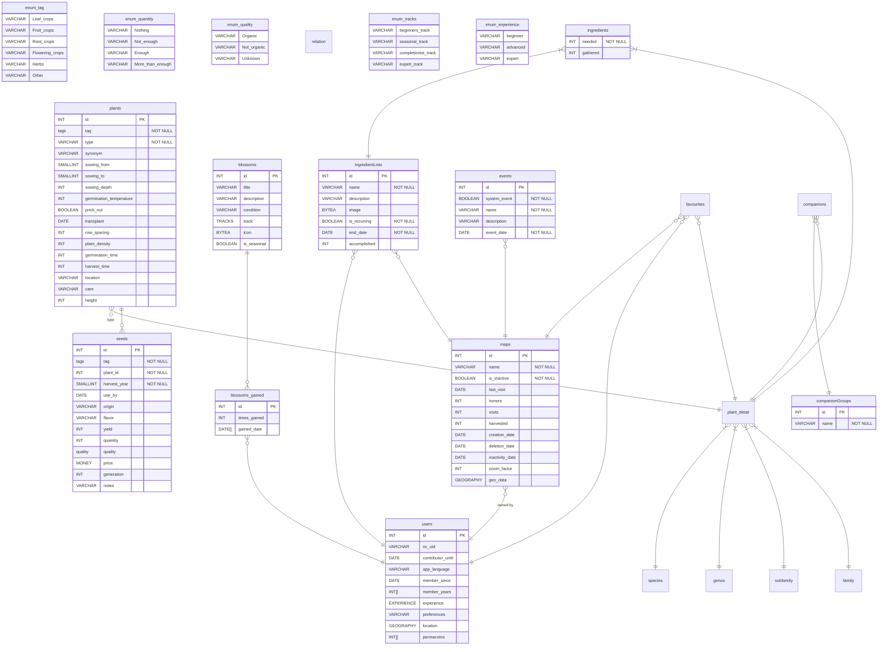

# Database Schemata

Tag and Quality in this case are enum.
Postgres supports [enums](https://www.postgresql.org/docs/current/datatype-enum.html) so it is easy to define a static set of values.
Right now, Mermaid doesn't support enum types so a `_` character denotes white spaces in enums.

# ER Diagram



# Table descriptions

## `Plant_detail`

| **_Column name_**                | **_Example_**                    | **_Initial rule_**                                                                                | **_Description_**                  |
| :------------------------------- | :------------------------------- | :------------------------------------------------------------------------------------------------ | :--------------------------------- |
| **id**                           | 1                                |
| **binomial_name**                | Abelia triflora                  |
| **common_name**                  | NULL                             |
| **common_name_de**               | NULL                             |
| **family**                       | Caprifoliaceae                   |
| **subfamily**                    | NULL                             |
| **genus**                        | Abelia                           |
| **edible_uses**                  | NULL                             |
| **medicinal_uses**               | NULL                             |
| **material_uses_and_functions**  | \[1\]\[2\]                       |
| **botanic**                      | \[3\]\[6\]                       |
| **propagation**                  | NULL                             |
| **cultivation**                  | NULL                             |
| **environment**                  | NULL                             |
| **material_uses**                | NULL                             |
| **functions**                    | NULL                             |
| **provides_forage_for**          | NULL                             |
| **provides_shelter_for**         | NULL                             |
| **hardiness_zone**               | 6                                |
| **heat_zone**                    | NULL                             |
| **water**                        | moderate                         |
| **sun**                          | full sun                         |
| **shade**                        | light shade                      |
| **soil_ph**                      | {neutral,alkaline,very alkaline} |
| **soil_texture**                 | {sandy,loamy}                    |
| **soil_water_retention**         | NULL                             |
| **environmental_tolerances**     | NULL                             |
| **native_climate_zones**         | NULL                             |
| **adapted_climate_zones**        | NULL                             |
| **native_geographical_range**    | NULL                             |
| **native_environment**           | NULL                             |
| **ecosystem_niche**              | NULL                             |
| **root_zone_tendancy**           | NULL                             |
| **deciduous_or_evergreen**       | deciduous                        |
| **herbaceous_or_woody**          | woody                            |
| **life_cycle**                   | {perennial}                      |
| **growth_rate**                  | slow                             |
| **mature_size_height**           | 3.5                              |
| **mature_size_width**            | 3                                |
| **fertility**                    | NULL                             |
| **pollinators**                  | NULL                             |
| **flower_colour**                | NULL                             |
| **flower_type**                  | hermaphrodite                    |
| **created_at**                   | 2023-02-09 14:06:01.451028       |
| **updated_at**                   | 2023-02-09 14:06:01.451028       |
| **has_drought_tolerance**        | false                            |
| **tolerates_wind**               | false                            |
| **plant_references**             | {ref1, ref2)}                    |
| **is_tree**                      | true                             | Set of Herbaceous/Woody (woody) AND life cycle (perennial)                                        |
| **nutrition_demand**             | NULL                             | If "Nutritionally poor soil" in `environmental_tolerances` is given `light feeder` should be set. |
| **preferable_permaculture_zone** | NULL                             |                                                                                                   | -1..6 (-1 should be printed as 00) |

## `Maps`

| **_Column name_**   | **_Example_** | **_Description_**                                                                              |
| :------------------ | :------------ | :--------------------------------------------------------------------------------------------- |
| **id**              | 1             |
| **owner_id**        | 1             |
| **name**            | My Map        | only alphanumerical values                                                                     |
| **is_inactive**     | false         |
| **last_visit**      | 2023-04-04    |
| **honors**          | 0             | 0 to infinity                                                                                  |
| **visits**          | 0             | 0 to infinity                                                                                  |
| **harvested**       | 0             | 0 to infinity, amount of plants harvested on this map                                          |
| **version_date**    | 2023-04-04    | the date the snapshot for this version was taken                                               |
| **creation_date**   | 2023-04-04    |
| **deletion_date**   | 2023-04-04    |
| **inactivity_date** | 2023-04-04    |
| **zoom_factor**     | 100           | value used in formula "X by X cm", e.g. 100 would mean "100 x 100 cm", range from 10 to 100000 |
| **geo_data**        | NULL          | PostGis Geodata, location of the map                                                           |

## `Users`

| **_Column name_**     | **_Example_**         | **_Description_**                                              |
| :-------------------- | :-------------------- | :------------------------------------------------------------- |
| **id**                | 1                     |
| **nc_uid**            | 1                     | Nextcloud ID                                                   |
| **contributor_until** | 2023-04-04            | has contributing membership until the given date               |
| **app_language**      | English               |
| **member_since**      | 2023-04-04            |
| **member_years**      | {2023}                | Array of years                                                 |
| **experience**        | beginner              |
| **preferences**       | raised vegetable beds |
| **location**          | Vienna, Austria       |
| **permacoins**        | {0}                   | 0 to infinity, one entry for every year since account creation |

## `Blossoms`

| **_Column name_** | **_Example_**          | **_Description_**                               |
| :---------------- | :--------------------- | :---------------------------------------------- |
| **id**            | 1                      |
| **title**         | Novice Gardener        |
| **description**   | Plant your first plant |
| **condition**     | plants.count() >= 1    | condition used to check if milestone is reached |
| **track**         | Beginners Track        | the track (category) this blossom belongs to    |
| **icon**          | NULL                   |
| **is_seasonal**   | false                  | resets and repeats every year                   |

## `Blossoms Gained`

| **_Column name_** | **_Example_** | **_Description_**               |
| :---------------- | :------------ | :------------------------------ |
| **id**            | 1             |
| **user_id**       | 1             |
| **blossom_id**    | 1             |
| **times_gained**  | 1             | 0 to infinity                   |
| **gained_date**   | {2023-04-10}  | one entry for every time gained |

## `IngredientLists`

| **_Column name_** | **_Example_**                          | **_Description_**                                                              |
| :---------------- | :------------------------------------- | :----------------------------------------------------------------------------- |
| **id**            | 1                                      | list id                                                                        |
| **owner_id**      | 1                                      | user id                                                                        |
| **map_id**        | 1                                      | id of the map this list is for                                                 |
| **name**          | Smoothie Ingredients                   | name of the list                                                               |
| **description**   | Ingredients for my strawberry smoothie | description of the list                                                        |
| **image**         | NULL                                   | an image for further customizing the list                                      |
| **is_recurring**  | true                                   | a flag representing whether the objectives repeat themselves or not            |
| **end_date**      | 2023-04-15                             | an optional date at which point the owner wants the objectives to be fulfilled |
| **accomplished**  | 0                                      | the number of times the list was fulfilled; only relevant for recurring lists  |

## `Ingredients`

Many-to-many table to store relations between plants and ingredient lists.

| **_Column name_** | **_Example_** | **_Description_**                                    |
| :---------------- | :------------ | :--------------------------------------------------- |
| **list_id**       | 1             | id of the ingredient list                            |
| **plant_id**      | 1             | id of the plant used as an ingredient                |
| **needed**        | 1             | the amount of this plant that is needed for the list |
| **gathered**      | 0             | the amount of this plant that was already gathered   |

## `Events`

| **_Column name_** | **_Example_**        | **_Description_**                                                  |
| :---------------- | :------------------- | :----------------------------------------------------------------- |
| **id**            | 1                    | event id                                                           |
| **map_id**        | 1                    | id of the map the event is taking place on                         |
| **system_event**  | true                 | a flag representing whether this event is system or user generated |
| **name**          | Harvest strawberries | name of the event                                                  |
| **description**   | NULL                 | description of the event details                                   |
| **event_date**    | 2023-04-15           | the date the event is taking place on                              |

## `Favourites`

Many-to-many table to store map-specific favourites.

| **_Column name_** | **_Example_** | **_Description_** |
| :---------------- | :------------ | :---------------- |
| **map_id**        | 1             | id of the map     |
| **user_id**       | 1             | id of the user    |
| **plant_id**      | 1             | id of the plant   |

## `CompanionGroups`

| **_Column name_** | **_Example_**      | **_Description_**                                                         |
| :---------------- | :----------------- | :------------------------------------------------------------------------ |
| **id**            | 1                  | companion group id                                                        |
| **name**          | My Companion Group | name of the companion group                                               |
| **[user_id]**     | 1                  | id of the user that owns this companion group (are groups user specific?) |
| **[map_id]**      | 1                  | id of the map that this companion group belongs to (map specific?)        |

## `Companions`

Many-to-many table to store relations between companion groups and plants.

| **_Column name_** | **_Example_** | **_Description_**  |
| :---------------- | :------------ | :----------------- |
| **group_id**      | 1             | companion group id |
| **plant_id**      | 1             | plant id           |

## `Relation`

Many-to-many table to store relations between plants, genus, subfamily and family.

| **_Column name_**     | **_Example_**              | **_Description_**                                                             |
| :-------------------- | :------------------------- | :---------------------------------------------------------------------------- |
| **id**                | 1                          | relation id                                                                   |
| **from_id**           | 1                          | id of the left side of the relation(id of plant, genus, subfamily or family)  |
| **from_type**         | genus                      | type can be plant, genus, subfamily or family                                 |
| **to_id**             | 1                          | id of the right side of the relation(id of plant, genus, subfamily or family) |
| **to_type**           | family                     | type can be plant, genus, subfamily or family                                 |
| **relation_type**     | companion                  | type of the relation can be companion, antagonist, neutral                    |
| **relation_strength** | 2                          | strength of the relation, can be 0 to 3                                       |
| **created_at**        | 2023-02-09 14:06:01.451028 | creation timestamp                                                            |
| **updated_at**        | 2023-02-09 14:06:01.451028 | update timestamp                                                              |

# Example queries

## Get all plants with their hierarchy information

```sql
SELECT *
  FROM plant_detail
  LEFT JOIN genus
            ON plant_detail.genus = genus.name
  LEFT JOIN subfamily
            ON plant_detail.subfamily = subfamily.name
  LEFT JOIN family
            ON plant_detail.family = family.name;
```

## Insert a relation between a plant with a specific genus and a specific family

```sql
INSERT INTO relations (from_id, from_type, to_id, to_type, relation_type, relation_strength)
VALUES (1, 'genus', 156, 'family', 'companion', 3);
```

## Get all plants that are companions to a specific family

```sql
SELECT p.id,
       p.binomial_name,
       p.genus,
       p.family,
       p.subfamily,
       r.*
  FROM plant_detail p
  LEFT JOIN genus
            ON p.genus = genus.name
  LEFT JOIN subfamily
            ON p.subfamily = subfamily.name
  LEFT JOIN family
            ON p.family = family.name
  JOIN relations r
       ON r.relation_type = 'companion' AND r.to_type = 'family' AND r.to_id = 156 AND
          CASE
              WHEN r.from_type = 'plant' THEN r.id = p.id
              WHEN r.from_type = 'genus' THEN r.id = genus.id
              WHEN r.from_type = 'subfamily' THEN r.id = subfamily.id
              WHEN r.from_type = 'family' THEN r.id = family.id
              END;
```
