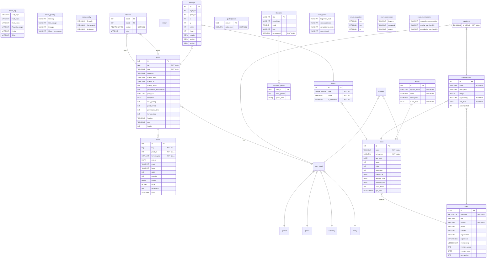

# ER diagram

```mermaid
erDiagram

enum_tag {
  VARCHAR Leaf_crops
  VARCHAR Fruit_crops
  VARCHAR Root_crops
  VARCHAR Flowering_crops
  VARCHAR Herbs
  VARCHAR Other
}

enum_quantity {
  VARCHAR Nothing
  VARCHAR Not_enough
  VARCHAR Enough
  VARCHAR More_than_enough
}

enum_quality {
  VARCHAR Organic
  VARCHAR Not_organic
  VARCHAR Unknown
}

seeds {
  INT id PK
  tags tag "NOT NULL"
  INT plant_id "NOT NULL"
  SMALLINT harvest_year "NOT NULL"
  DATE use_by
  VARCHAR origin
  VARCHAR flavor
  INT yield
  INT quantity
  quality quality
  MONEY price
  INT generation
  VARCHAR notes
}

plants {
  INT id PK
  tags tag "NOT NULL"
  VARCHAR type "NOT NULL"
  VARCHAR synonym
  SMALLINT sowing_from
  SMALLINT sowing_to
  INT sowing_depth
  INT germination_temperature
  BOOLEAN prick_out
  DATE transplant
  INT row_spacing
  INT plant_density
  INT germination_time
  INT harvest_time
  VARCHAR location
  VARCHAR care
  INT height
}

plant_detail{}

plants }o--|| plant_detail: "type"

plants ||--o{ seeds : ""

relations {
  INT plant1 PK
  INT plant2 PK
  RELATION_TYPE relation "NOT NULL"
  VARCHAR note
}
relations }o--|| plants : "plant1"
relations }o--|| plants : "plant2"

species{}
genus{}
subfamily{}
family{}

relation{}

plant_detail }|--|| species : ""
plant_detail }|--|| genus : ""
plant_detail }|--|| subfamily : ""
plant_detail }|--|| family : ""

maps {
  INT id PK
  VARCHAR name "NOT NULL"
  BOOLEAN is_inactive "NOT NULL"
  DATE last_visit
  INT honors
  INT visits
  INT harvested
  DATE created_at
  DATE deletion_date
  DATE inactivity_date
  INT zoom_factor
  GEOGRAPHY geo_data
}

layers {
  INT id PK
  LAYER_TYPES type "NOT NULL"
  VARCHAR name "NOT NULL"
  BOOLEAN is_alternative "NOT NULL"
}
layers }|--|| maps : ""

plantings {
    INT id PK
    INT layer_id
    INT plant_id
    INT x
    INT y
    INT width
    INT height
    REAL rotation
    REAL scale_x
    REAL scale_y
}
plantings }o--|| layers : ""
plantings }o--|| plants : ""

users {
  UUID id PK
  SALUTATION salutation "NOT NULL"
  VARCHAR title
  VARCHAR country "NOT NULL"
  VARCHAR phone
  VARCHAR website
  VARCHAR organization
  EXPERIENCE experience
  MEMBERSHIP membership
  INT[] member_years
  DATE member_since
  INT[] permacoins
}

guided_tours {
  UUID user_id PK
  BOOLEAN editor_tour "NOT NULL"
}

blossoms {
  VARCHAR title PK
  VARCHAR description
  TRACKS track
  VARCHAR icon
  BOOLEAN is_seasonal "NOT NULL"
}

enum_tracks {
  VARCHAR beginners_track
  VARCHAR seasonal_track
  VARCHAR completionist_track
  VARCHAR expert_track
}

enum_salutation {
  VARCHAR ms
  VARCHAR mrs
  VARCHAR mr
}

enum_experience {
  VARCHAR beginner
  VARCHAR advanced
  VARCHAR expert
}

enum_membership {
  VARCHAR supporting_membership
  VARCHAR regular_membership
  VARCHAR contributing_membership
}

blossoms_gained {
  UUID user_id PK
  INT times_gained
  DATE[] gained_date
}

maps }o--|| users : "owned by"
blossoms ||--o{ blossoms_gained : ""

ingredientLists {
  INT id PK
  VARCHAR name "NOT NULL"
  VARCHAR description
  BYTEA image
  BOOLEAN is_recurring "NOT NULL"
  DATE end_date "NOT NULL"
  INT accomplished
}

ingredients {
  BOOLEAN is_fulfilled "NOT NULL"
}

ingredientLists }o--|| users : ""
ingredientLists }o--|| maps : ""
ingredients }|--|| ingredientLists : ""
ingredients }|--|| plant_detail : ""

events {
  INT id PK
  BOOLEAN system_event "NOT NULL"
  VARCHAR name "NOT NULL"
  VARCHAR description
  DATE event_date "NOT NULL"
}

events }o--|| maps : ""

favorites {}

favorites }o--|| maps : ""
favorites }o--|| plant_detail : ""

```
