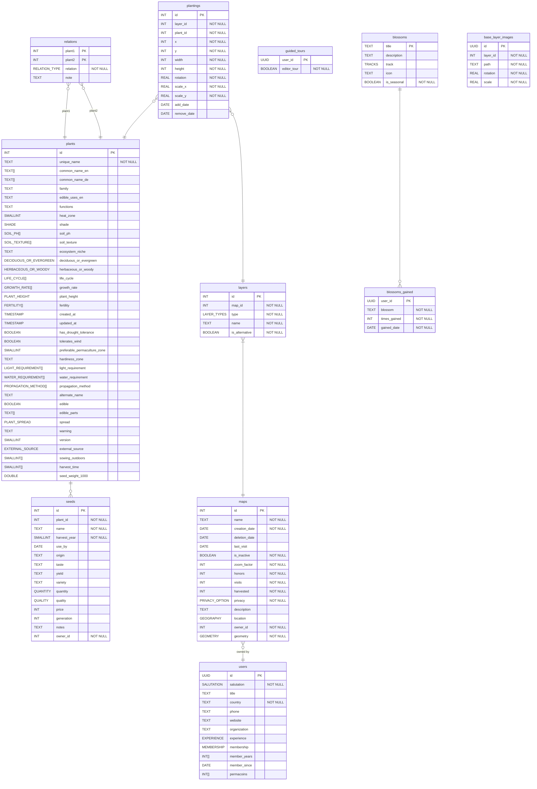

# ER diagram

## Plants Table

For performance reasons, we decided to disable some unused columns in the plants table for now.

For more information, see: [PR #644](https://github.com/ElektraInitiative/PermaplanT/pull/644)

The following columns are commented out for now:

- genus: text
- medicinal_uses: text
- material_uses_and_functions: text
- botanic: text
- material_uses: text
- soil_water_retention: soil_water_retention[]
- environmental_tolerances: text[]
- native_geographical_range: text
- native_environment: text
- flower_colour: text
- flower_type: flower_type
- plant_references: text[]
- is_tree: boolean
- nutrition_demand: nutrition_demand
- article_last_modified_at: timestamp without time zone
- diseases: text
- germination_temperature: text
- introduced_into: text
- habitus: text
- medicinal_parts: text
- native_to: text
- plants_for_a_future: text
- plants_of_the_world_online_link: text
- plants_of_the_world_online_link_synonym: text
- pollination: text
- propagation_transplanting_en: text
- resistance: text
- root_type: text
- seed_planting_depth_en: text
- seed_viability: text
- slug: text
- utility: text
- when_to_plant_cuttings_en: text
- when_to_plant_division_en: text
- when_to_plant_transplant_en: text
- when_to_sow_indoors_en: text
- sowing_outdoors_en: text
- when_to_start_indoors_weeks: text
- when_to_start_outdoors_weeks: text
- cold_stratification_temperature: text
- cold_stratification_time: text
- days_to_harvest: text
- habitat: text
- spacing_en: text
- wikipedia_url: text
- days_to_maturity: text
- pests: text
- germination_time: text
- description: text
- parent_id: text
- external_id: text
- external_url: text
- root_depth: text
- external_article_number: text
- external_portion_content: text
- sowing_outdoors_de: text
- spacing_de: text
- required_quantity_of_seeds_de: text
- required_quantity_of_seeds_en: text
- seed_planting_depth_de: text
- seed_weight_1000_de: text
- seed_weight_1000_en: text
- machine_cultivation_possible: boolean
- edible_uses_de: text

<!--

These are leftovers from the old ER diagram.
We'll keep them for now. We will create new issues in the near future for them.
These will be implemented, when we implement UC [Ingredient_list](./doc/usecases/assigned/ingredient_lists.md), UC [watering_layer](./doc/usecases/assigned/watering_layer.md) and UC [map_timeline_event_view](./doc/usecases/assigned/map_timeline_event_view.md)

ingredientLists_WIP {
  INT id PK
  TEXT name "NOT NULL"
  TEXT description
  BYTEA image
  BOOLEAN is_recurring "NOT NULL"
  DATE end_date "NOT NULL"
  INT accomplished
}

ingredients_WIP {
  BOOLEAN is_fulfilled "NOT NULL"
}

events {
  INT id PK
  BOOLEAN system_event "NOT NULL"
  TEXT name "NOT NULL"
  TEXT description
  DATE event_date "NOT NULL"
}

favorites {}

ingredientLists }o--|| users : ""
ingredientLists }o--|| maps : ""
ingredients }|--|| ingredientLists : ""
ingredients }|--|| plants : ""
events }o--|| maps : ""
favorites }o--|| maps : ""
favorites }o--|| plants : ""

 -->

   <!--
  Leftover column from seeds, but not implemented, still needed?
  seeds
  tags tag "NOT NULL" -->

<!--
  plants
  Leftover column from plants, but not implemented, still needed?

  tags tag "NOT NULL"
  TEXT type "NOT NULL"
  TEXT synonym
  SMALLINT sowing_from
  SMALLINT sowing_to
  INT sowing_depth
  INT germination_temperature
  BOOLEAN prick_out
  DATE transplant
  INT row_spacing
  INT plant_density
  INT germination_time
  INT harvest_time
  TEXT location
  TEXT care
-->

  <!--
  Leftover column from maps, but not implemented, still needed?
  maps
   DATE inactivity_date -->

   <!--#
   plantings - should be both DATETIME and add_date should have NOW()
    DATE add_date
    DATE remove_date

    -->
