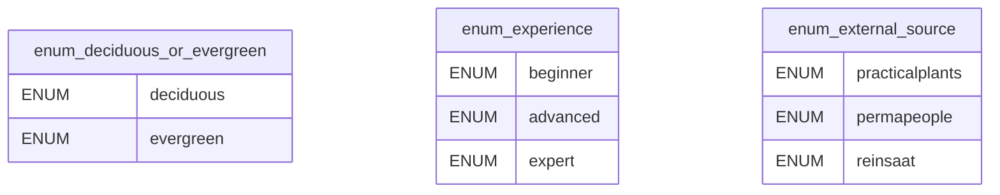
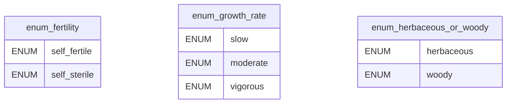
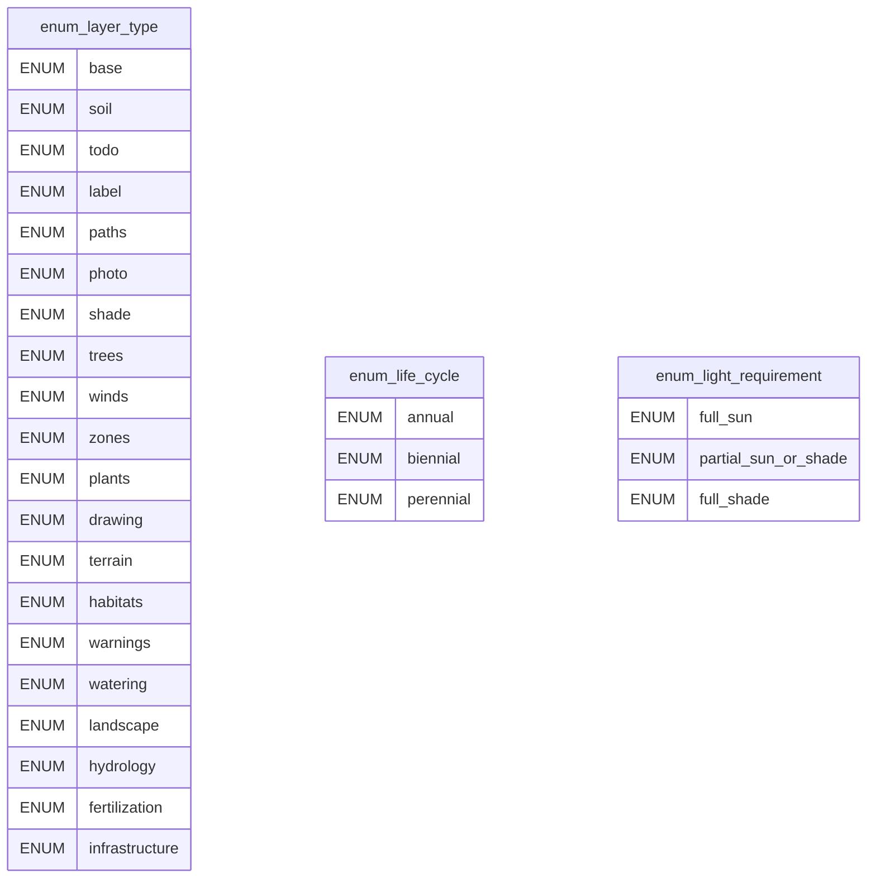
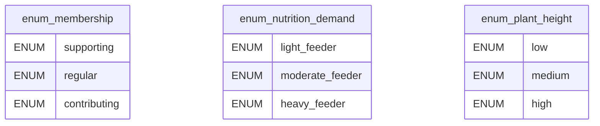
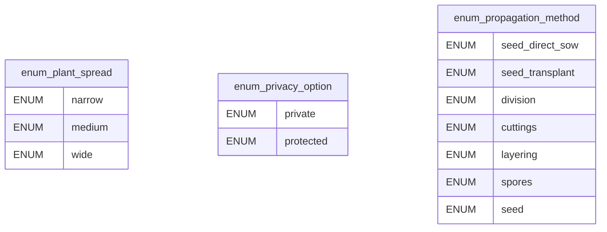
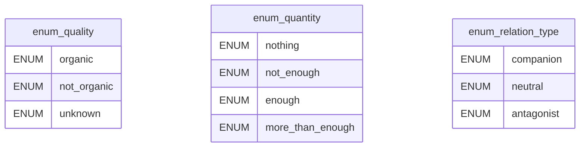
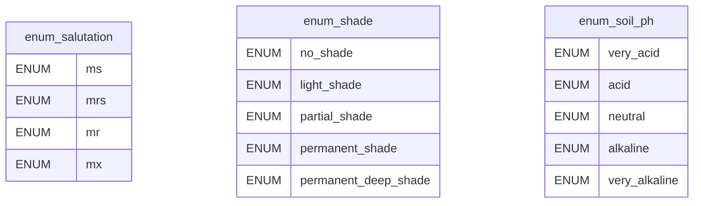
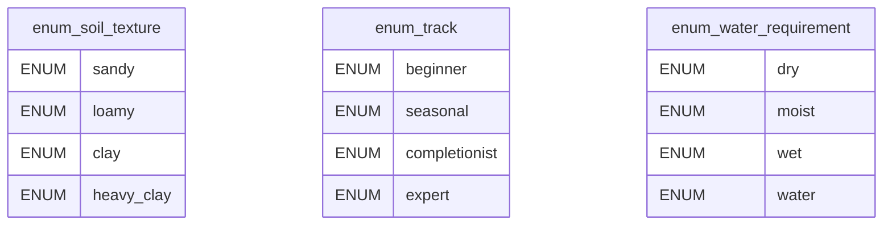
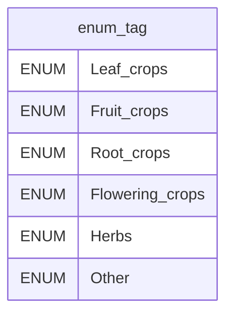

# Enum Types

### These are all the enum types we currently have implemented:

```mermaid
erDiagram

enum_deciduous_or_evergreen{
    ENUM deciduous
    ENUM evergreen
}
enum_experience{
    ENUM beginner
    ENUM advanced
    ENUM expert
}
enum_external_source{
    ENUM practicalplants
    ENUM permapeople
    ENUM reinsaat
}

```

```mermaid
erDiagram

enum_fertility{
    ENUM self_fertile
    ENUM self_sterile
}
enum_growth_rate{
    ENUM slow
    ENUM moderate
    ENUM vigorous
}
enum_herbaceous_or_woody{
    ENUM herbaceous
    ENUM woody
}

```

```mermaid
erDiagram

enum_layer_type{
    ENUM base
    ENUM soil
    ENUM todo
    ENUM label
    ENUM paths
    ENUM photo
    ENUM shade
    ENUM trees
    ENUM winds
    ENUM zones
    ENUM plants
    ENUM drawing
    ENUM terrain
    ENUM habitats
    ENUM warnings
    ENUM watering
    ENUM landscape
    ENUM hydrology
    ENUM fertilization
    ENUM infrastructure
}
enum_life_cycle{
    ENUM annual
    ENUM biennial
    ENUM perennial
}
enum_light_requirement{
    ENUM full_sun
    ENUM partial_sun_or_shade
    ENUM full_shade
}

```

```mermaid
erDiagram

enum_membership{
    ENUM supporting
    ENUM regular
    ENUM contributing
}
enum_nutrition_demand{
    ENUM light_feeder
    ENUM moderate_feeder
    ENUM heavy_feeder
}
enum_plant_height{
    ENUM low
    ENUM medium
    ENUM high
}

```

```mermaid
erDiagram

enum_plant_spread{
    ENUM narrow
    ENUM medium
    ENUM wide
}
enum_privacy_option{
    ENUM private
    ENUM protected

}
enum_propagation_method{
    ENUM seed_direct_sow
    ENUM seed_transplant
    ENUM division
    ENUM cuttings
    ENUM layering
    ENUM spores
    ENUM seed
}

```

```mermaid
erDiagram

enum_quality{
    ENUM organic
    ENUM not_organic
    ENUM unknown
}
enum_quantity{
    ENUM nothing
    ENUM not_enough
    ENUM enough
    ENUM more_than_enough
}
enum_relation_type{
    ENUM companion
    ENUM neutral
    ENUM antagonist
}

```

```mermaid
erDiagram

enum_salutation{
    ENUM ms
    ENUM mrs
    ENUM mr
    ENUM mx
}
enum_shade{
    ENUM no_shade
    ENUM light_shade
    ENUM partial_shade
    ENUM permanent_shade
    ENUM permanent_deep_shade
}
enum_soil_ph{
    ENUM very_acid
    ENUM acid
    ENUM neutral
    ENUM alkaline
    ENUM very_alkaline
}

```

```mermaid
erDiagram

enum_soil_texture{
    ENUM sandy
    ENUM loamy
    ENUM clay
    ENUM heavy_clay
}
enum_track{
    ENUM beginner
    ENUM seasonal
    ENUM completionist
    ENUM expert
}
enum_water_requirement{
    ENUM dry
    ENUM moist
    ENUM wet
    ENUM water
}

```

### These are all the enum types we currently have NOT implemented:

```mermaid
erDiagram

enum_tag{
    ENUM Leaf_crops
    ENUM Fruit_crops
    ENUM Root_crops
    ENUM Flowering_crops
    ENUM Herbs
    ENUM Other
}

```
