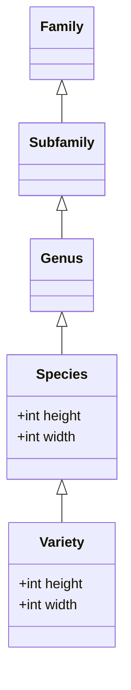

# Database Structure (TBD)

The main goal of this document is to describe the database structure/layout especially in terms of relations between data entities.

## Problem

Semantically the plant information can be described as a hierarchy of entities.

A plant can be classified

-   on variety level, and/or
-   on species level.

Furthermore:

-   a variety belongs to a specie
-   specie belongs to a genus
-   genus belongs to a subfamily or family
-   subfamily belongs to a family.

Please take a look at the diagram below, which shows the hierarchy of entities with `height` and `width` as an example of attribute classification described above.

Each of these entities can have their own properties.
E.g., a variety under a specie can have different height than the specie that it belongs to.

The challenge is to define the structure of the database in a way that the data

-   can be easily queried and
-   updated without redundancy (e.g. setting attributes for a whole family).

## Constraints

-   The database structure should represent the hierarchy of entities described above.
-   The database structure should be able to store relations between entities.

## Assumptions

-   Performance of the database utilizing structure described in this decision is efficient enough for our use case.

## Considered Alternatives

1. Inheritance feature of PSQL

Inheritance cannot solve the challenge described above. I'll leave the main points from the [PSQL documentation](https://www.postgresql.org/docs/current/ddl-inherit.html) here:

> Inheritance does not automatically propagate data from INSERT or COPY commands to other tables in the inheritance hierarchy.

> All check constraints and not-null constraints on a parent table are automatically inherited by its children, unless explicitly specified otherwise with NO INHERIT clauses. Other types of constraints (unique, primary key, and foreign key constraints) are not inherited.

> Table inheritance is typically established when the child table is created, using the INHERITS clause of the CREATE TABLE statement.

So the inheritance is useful to deal with complex DDL structure on the startup, but will not help us to avoid bulk operations e.g. updating a column for every `variety` in the entire `genus`

## Decision

1. Hierarchy

Hierarchy of entities should be implemented using foreign keys and table relationships instead of Inheritance feature of PSQL. So the main idea is to consider entries in the `plant_detail` table as varieties and look up information about parent entities in the metatables described in the next point, if needed.

In case of a conflict, the lowest entity level in the hierarchy is prioritized. E.g. when there is a height value in a species and in a variety, variety wins.

Plant relations(e.g. like, dislike, etc.) should be implemented using separate many-to-many tables. This is because the relations are not part of the plant entity, but rather a property of the relationship between two plants.

2. Metatables for parent entities i.e. genus, subfamily, family

Metatables are independent tables that contain information about the parent entities. E.g. genus table will contain information about the genus, while the data of plants of that genus will be stored in the `plant_detail` table.

## Rationale

1. Hierarchy

discussed in the section "Considered Alternatives".

2. Metatables

The reason for this is that the data of the parent entities is not going to change very often, while the data of the child entities will change more often. So it makes sense to separate the data into two tables.

Since there is no information about the parent entities on the practicalplants website, we will have to populate the metatables manually.
For this purpose, during the parsing we are creating csv files with distinct values of genus, subfamily, family. These csv files will be used to populate the metatables.

## Implications

## Related Decisions

## Notes

In order to finish this decision, we need to understand the semantics of the data better.

TODO:

- [] define how exactly hierarchy tables will look like
- [] define how metatables should be connected to the hierarchy tables
- [] define how the relations between plants will be stored