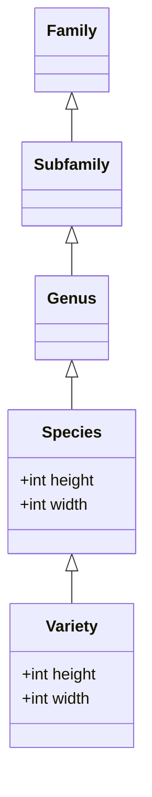

# Database Structure

The main goal of this document is to describe the database structure/layout especially in terms of relations between data entities.

## Problem

Semantically the plant information can be described as a hierarchy of entities. E.g., a plant is always a member on the variety level, while a variety is a part of species, species is a part of genus, genus is a part of subfamily, subfamily is a part of family. Please take a look at the diagram below. Each of these entities can have their own properties, e.g., a variety under a specie can have different height than the specie that it belongs to.

The challenge is to define the structure of the database in a way that the data can be easily queried and updated.

Another goal is to be able to define relations between entities, e.g., a plant of one variety doesn't want to be neighbor to plant of some other variety.

## Constraints

## Assumptions

## Considered Alternatives

## Decision

1. Hierarchy

Hierarchy of entities should be implemented using foreign keys and table relationships instead of Inheritance feauture of PSQL(see point 1 under Rationale section below for detailed exaplanation). In case of a conflict, the lowest entity level in the hierarchy is prioritized. E.g. when there is a height value in a species and in a variety, variety wins.

Plant relations(e.g. like, dislike, etc.) should be implemented using separate many-to-many tables. This is because the relations are not part of the plant entity, but rather a property of the relationship between two plants. This is not possible with inheritance feature of PSQL.

1. plants as a flat table

2. Metatables for parent entities i.e. genus, subfamily, family

## Rationale

1. Inheritance

Inheritance feature of PSQL cannot solve the challenge described above. I'll leave the main points from the [PSQL documentation](https://www.postgresql.org/docs/current/ddl-inherit.html) here:

> Inheritance does not automatically propagate data from INSERT or COPY commands to other tables in the inheritance hierarchy.

> All check constraints and not-null constraints on a parent table are automatically inherited by its children, unless explicitly specified otherwise with NO INHERIT clauses. Other types of constraints (unique, primary key, and foreign key constraints) are not inherited.

> Table inheritance is typically established when the child table is created, using the INHERITS clause of the CREATE TABLE statement.

So the inheritance is useful to deal with complex DDL structure on the startup, but will not help us to avoid bulk operations e.g. updating a column for every `variety` in the entire `genus`

## Implications

## Related Decisions

## Notes
