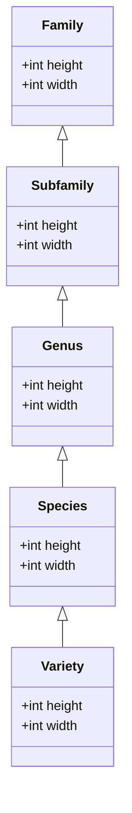

# Database Structure

The main goal of this document is to describe the database schema focusing on hierarchical information of plants and relationships between them.

## Problem

Semantically the plant information can be described as a hierarchy of entities.

A plant can be classified

- on variety level, and/or
- on species level.

Furthermore:

- a variety belongs to a specie
- specie belongs to a genus
- genus belongs to a subfamily or family
- subfamily belongs to a family.

Please take a look at the diagram below, which shows the hierarchy of entities with `height` and `width` as an example of attribute classification described above.

Each of these entities can have their own attributes.
E.g., a variety under a specie can have different height than the specie that it belongs to.

The challenge is to define the structure of the database in a way that the data

- can be easily queried and
- updated without redundancy (e.g. setting attributes for a whole family).

## Constraints

- The database structure should represent the hierarchy of entities described above.
- The database structure should be able to store relations between entities.

## Assumptions

- Performance of the database utilizing structure described in this decision is efficient enough for our use case.

## Considered Alternatives

1. Inheritance feature of PSQL

Inheritance cannot solve the challenge described above. I'll leave the main points from the [PSQL documentation](https://www.postgresql.org/docs/current/ddl-inherit.html) here:

> Inheritance does not automatically propagate data from INSERT or COPY commands to other tables in the inheritance hierarchy.

> All check constraints and not-null constraints on a parent table are automatically inherited by its children, unless explicitly specified otherwise with NO INHERIT clauses. Other types of constraints (unique, primary key, and foreign key constraints) are not inherited.

> Table inheritance is typically established when the child table is created, using the INHERITS clause of the CREATE TABLE statement.

So the inheritance is useful to deal with complex DDL structure on the startup, but will not help us to avoid bulk operations e.g. updating a column for every `variety` in the entire `genus`

2. One table per taxonomy rank and one for concrete plants.

[Example](example_migrations/one-table-per-taxonomy)

Pros:

- Schema is easy to understand.

Cons:

By splitting the taxonomy ranks into multiple tables we loose the ability to have simple foreign keys to these when defining plant relationships.
There would be two approaches to alleviate this.

- Manage multiple nullable foreign keys and make sure that exactly one of them is set.
  Would lead to complex validations for inserts and updates.
- Generalize it to a self-managed compound foreign key with a table name and id.
  We would lose referential integrity here.

3. One table for taxonomy ranks and one for concrete plants.

[Example](example_migrations/taxonomy-ranks-and-concrete-plants)

Pros:

- Inserting new plants is easy.

Cons:

- Attribute overrides can only be done on variety level.

4. Plants and ranks in one table.

[Example](example_migrations/normalized-plants-and-ranks)

Pros:

- Flexible and extendable.
- Allow attribute overrides on arbitrary level.

Cons:

- Almost everything in the plants table needs to be nullable.
- More complex insert and update logic.
  When a species/variety is added or updated the columns can't just be set.
  First we need to make sure all higher levels are in the table.
  Then we need to check for each column value if there is a higher rank that already defines the same value.
  Only if we can't find a match the value should be written.

## Decision

1. Hierarchy

We will go with variant 4 from [Considered Alternatives](#considered-alternatives).

2. Relations between plants

Plant relations (e.g. companion) should be implemented using a separate many-to-many table.

For details on the schema see this [example sql](example_migrations/normalized-plants-and-ranks/2023-04-07-130215_plant_relationships/up.sql)
Here are some [example queries](example_migrations/normalized-plants-and-ranks/example_queries.sql)

## Rationale

1. Hierarchy

discussed in the section "Considered Alternatives".

3. Relations between plants

The relations are not part of the plant entity, but rather a property of the relationship between two plants.
Additionally, the relation should provide cross-hierarchy relationships, e.g., a genus doesn't like a family.

## Implications

The most complex aspect of this solution is described at variant 4 in [Considered Alternatives](#considered-alternatives).
This will be especially important when the database receives an update via the scraper.
To reuse inserting and updating logic the backend should implement an executable that enables csv imports of what the scraper produces.

## Related Decisions

## Notes

The relationships schemata shown in these examples all have a column that distinguished between companions and antagonists.
Looking at the example queries for selecting companion plants for groups it might be more efficient to split this table.
